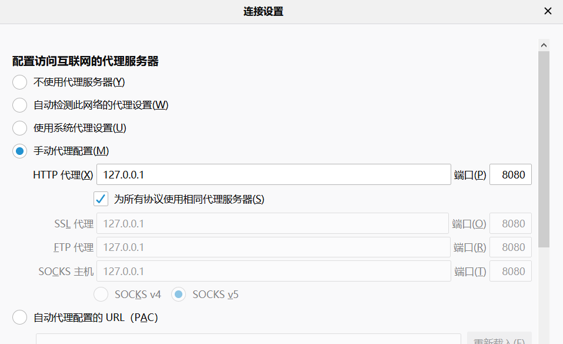
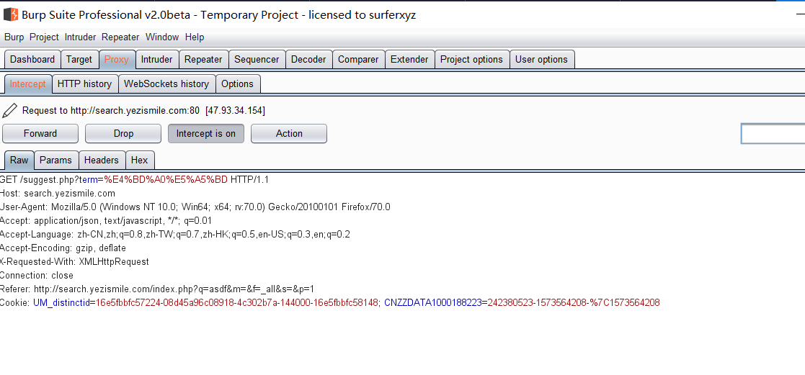
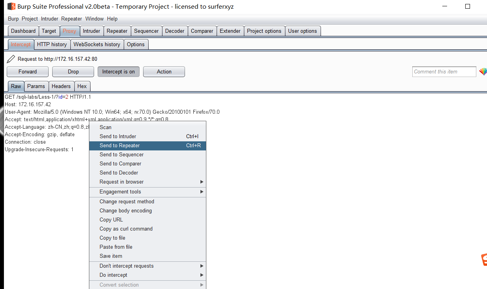
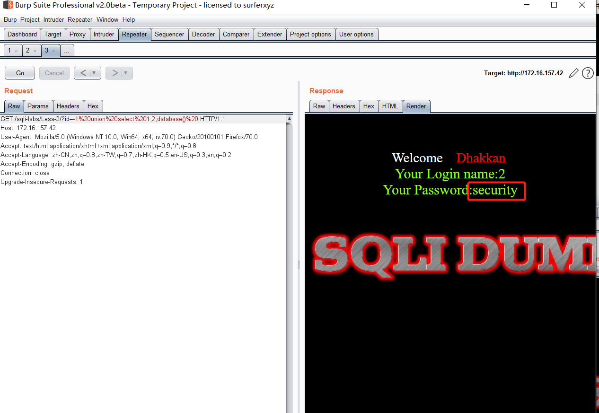
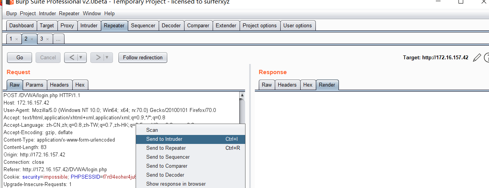
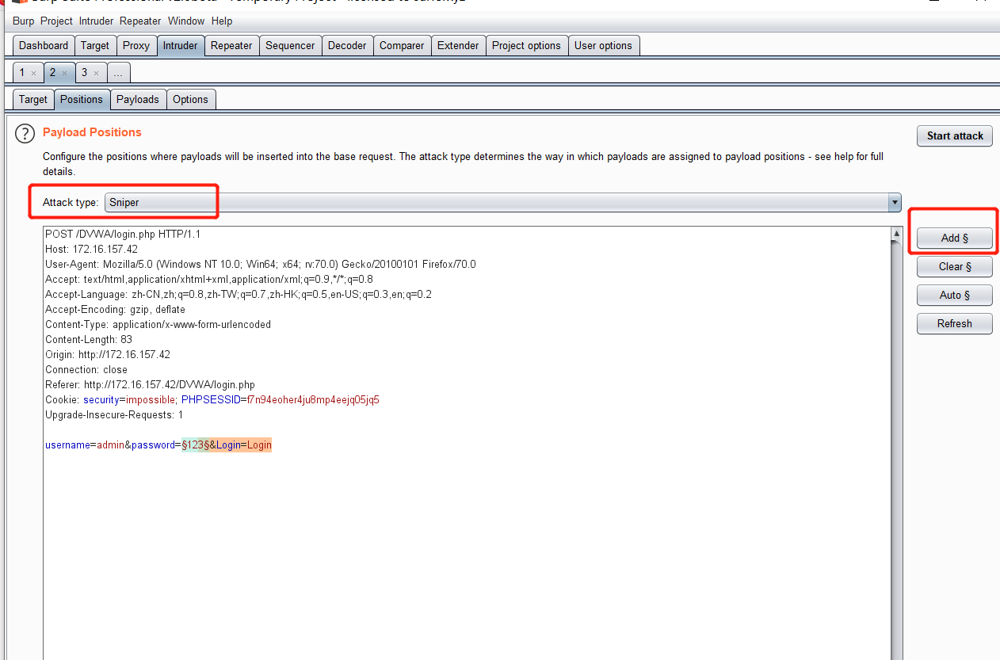
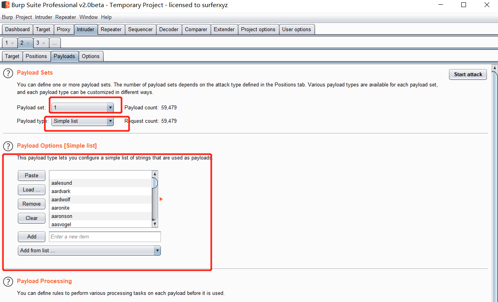
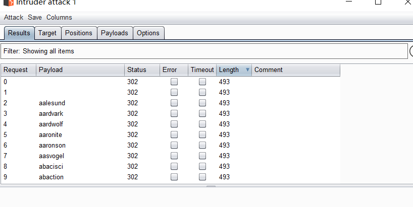
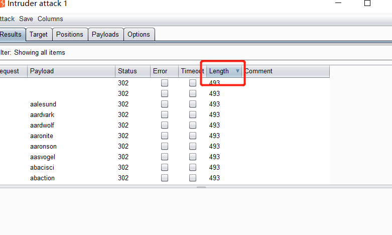

## week 9(date:2019110420191111)

### Algorithm

##### leetcode 初级算法-篇

1. **爬楼梯**：https://leetcode-cn.com/explore/featured/card/top-interview-questions-easy/23/dynamic-programming/54/

   题目描述:

```
假设你正在爬楼梯。需要 n 阶你才能到达楼顶。
每次你可以爬 1 或 2 个台阶。你有多少种不同的方法可以爬到楼顶呢？
注意：给定 n 是一个正整数。
```

思路1 . (ps:超时）:

通过递归走梯子：climbStairs(n-2)+climbStairs(n-1)，说明：向前走一步或者走两步。

```java
    public int climbStairs(int n) {
        if(n==1){
            return 1;
        }else if(n==2){
            return 2;
        }
        return climbStairs(n-2)+climbStairs(n-1);
        
    }
```

思路2. (）:

通过观察，每个数据：climbStairs(n）=climbStairs(n-2)+climbStairs(n-1)，可以构造数组来保存数据。

```java
    public int climbStairs(int n) {
        if(n==1){
            return 1;
        }        
        if(n==2){
            return 2;
        }
        int[] temp=new int[n+1];
        temp[0]=1;
        temp[1]=2;
        for(int i=2;i<n;i++){
            temp[i]=temp[i-1]+temp[i-2]; 
        }
        return temp[n-1];
        
    }
```

2. **买卖股票的最佳时机**：https://leetcode-cn.com/explore/interview/card/top-interview-questions-easy/23/dynamic-programming/55/

   题目描述:

```
给定一个数组，它的第 i 个元素是一支给定股票第 i 天的价格。

如果你最多只允许完成一笔交易（即买入和卖出一支股票），设计一个算法来计算你所能获取的最大利润。

注意你不能在买入股票前卖出股票。
```

思路:

  找最小值向后的最大值，如果比最大值减最小值比最大利润大就更新最大利润。

```java
    public int maxProfit(int[] prices) {
        int min=Integer.MAX_VALUE;
        //最大利润
        int depth=0;
        for(int i=0;i<prices.length;i++){
            if(min>prices[i]){
                min=prices[i];
            }
            if(depth<(prices[i]-min)){
                depth=prices[i]-min;
            }
        }
       return depth;
    }
```

### Review

## Machine Learning Algorithms Explained - Naive Bayes Classifier

##### ：https://blog.easysol.net/machine-learning-algorithms-4/

##### 单词:

1. Naive Bayes Classifier  朴素贝叶斯分类器
2.  statistically independent 统计上独立
3. hypothesis  假设
4. denote  表示
5. individual  个体
6. suppose  假设
7. probabilities  概率
8. categorize  分类
9. deviation  偏差


##### 文章大意：

机器学习算法解释：朴素贝叶斯分类器

		贝叶斯分类器的基本方法：假定特征在统计上是独立的在，依据找到的一些特征属性，来计算各个类别的概率，找到概率最大的类，从而实现分类。

##### **贝叶斯定理**


**解释**：

- “ P”是表示概率的符号。

- P（A | B）=在发生了B的条件下，发生事件A的概率。

- P（A ）= 事件A的概率。

  朴素贝叶斯算法：


###### **优缺点**

- 优点
- 简单模型
  - 快速
  - 可扩展
  - 需要很少的数据
- 缺点
  - 假设特征之间相互独立
  - 必须选择似然函数


### Tips

- 

### Share
#### **网络安全攻防**

一、 安装软件

​	安装下列软件：


​	说明：

  1. 解压压缩包，安装burp

     

     可以在cmd使用：`java -jar burp-loader-keygen.jar` 启动激活工具。

     ​		burp 激活步骤如下：

     1. 
     2. 
     3. 

  2. 安装火狐浏览器、jdk

  3. 将hackbar（火狐浏览器插件） 导入火狐浏览器中。

     安装好后按f12 ：如下效果

     

二、环境配置（安装好上述软件后）

1. 配置burp 代理：

   
   
   2. 配置浏览器代理与burp一致：
   
       ，

二、拦截请求

​	配置完成后。使用火狐浏览器访问服务器发送的请求或者接收到的内容，都可以通过burp拦截。

1. 打开拦截

   

   2. 右键send to repeatet

      

      然后在repeater中修改参数可以实现sql注入。

三、sql注入

sql注入语句（数字型）： `id=-1 union select 1,2,database()`查询数据库名称
sql注入语句（字符串型）： `id=-1" union select 1,2,database() --+`查询数据库名称
注释：字符串" 为了闭合字符串。 --+或者#或者%23：注释后面的sql代码。


查询表名

`id=-1 union select 1,2,(select group_concat(table_name) from information_schema.tables where table_schema='security')


查询列名

id=-1 union select 1,2,(select group_concat(column_name) from information_schema.columns where table_schema='security' and table_name='users')


四、暴力破解

通过定义变量实现对字典的遍历：

拦截到请求后 ：



然后在intruder模块中，增加需要替换的内容、攻击的类型：



然后指定变量的类型。选择需要的数据字典。



点击右上角的start attack 进行暴力破解。



通过返回的Length的长度不一致或者状态等信息进行判断是否成功。


​		

