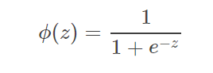
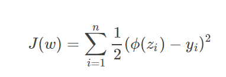
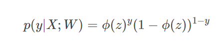
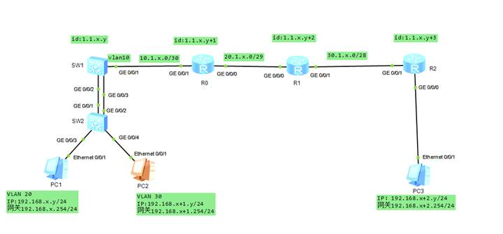

## week 11(date:2019111120191117)

### Algorithm

##### leetcode 初级算法-篇

1. **最大子序和**：https://leetcode-cn.com/explore/interview/card/top-interview-questions-easy/23/dynamic-programming/56/

   题目描述:
   
   给定一个整数数组 `nums` ，找到一个具有最大和的连续子数组（子数组最少包含一个元素），返回其最大和。
   
   **示例:**

```
输入: [-2,1,-3,4,-1,2,1,-5,4],
输出: 6
解释: 连续子数组 [4,-1,2,1] 的和最大，为 6。
```

思路:

通过判断`tempSum+nums[i]<nums[i]`的值，存储遍历到当前节点的最大值。

遍历存储的数组，取出最大值。

```java
    public int maxSubArray(int[] nums) {
        int maxSum=nums[0];
        int tempSum=nums[0];
        List<Integer> resList=new ArrayList<Integer>();
        if(nums.length==1){
            return tempSum;
        }
        
        for(int i=1;i<nums.length;i++){
            if(tempSum+nums[i]<nums[i]){
                tempSum=nums[i];
                resList.add(tempSum);
            }else{
                tempSum=tempSum+nums[i];
                resList.add(tempSum);
            }
        }
        for(Integer i: resList){
            if(i>maxSum){
                maxSum=i;
            }
        }
        return maxSum;
    }
```

2. **3的幂**：https://leetcode-cn.com/explore/interview/card/top-interview-questions-easy/25/math/62/

   题目描述:

```
给定一个整数，写一个函数来判断它是否是 3 的幂次方。
```

思路:

```java
    public boolean isPowerOfThree(int n) {
        if(n==1){
            return true;
        }
        if(n<3){
            return false;
        }
        while(n!=3){
            if(n%3!=0){
                return false;
            }
            n=n/3;
        }
        return true;
    }
```

### Review

## Machine Learning Algorithms Explained - Logistic Regression

##### ：https://blog.easysol.net/machine-learning-algorithms-5/

##### 单词:

1. categorical 绝对的
2.  categories 类别
3. statistical   统计学的
4. comprised  包括
5. species 种类
6. present   表明
7. an estimation of the coefficient   系数估计
8. evident   明显
9. significant  重要的
10. emphasized  强调


##### 文章大意：

机器学习算法解释：逻辑回归（文章看的不是很懂）。

其他材料关于逻辑回归的解释（https://blog.csdn.net/guoziqing506/article/details/81328402）。
在逻辑回归中，也就是Sigmoid函数，（目的是为了方便后面的优化计算，函数值连续方便求导）：


将signmoid函数带入代价函数，线性回归的代价函数中。



那么当前代价函数的图像是一个非凸函数，非凸函数有不止一个极值点，导致不容易做最优化计算。也就是说，这个代价函数不能用。所以重新设计代价函数，如下



对于这个联合概率，我们可以通过计算参数的最大似然估计的那一套方法来确定使得联合概率最大的参数W，此时的W就是我们要选的最佳参数，它使得联合概率最大（即代价函数最小）。

对代价函数进行对数化处理。

最后用梯度下降法求代价函数的最小值。

###### **优缺点**

- 优势

  - 可解释性
  - 简单模型
  - 可扩展

  缺点

  - 假设特征独立


### Tips

##### 网络设备配置

- 命令帮助 使用 `命令 ?` 使用`tab`补全

- 使用 `display cur` 显示当前全部配置

- 交换机无法在端口设置ip，能通过创建vlan 设置ip

- 路由间的ospf 需要指定router  id

- 主机与路由器或者交换机使用 access连接，路由器与交换机一般用trunk连接。

- 静态路由的配置为 `ip route-static 目标地址 子网掩码 下一跳地址` （下一跳地址不能是本设备的地址）

  

### Share

#### 华为网络设备配置与调试

说明：new.paper为网络拓扑图

**实验目标：**

现有两台交换机sw1、sw2；三台路由器R0、R1、R2；三台PC，组成如图拓扑结构。
现要求：x按68，,y是1
1、PC1属于Vlan20 IP地址：192.168.x.y/24 网关：192.168.x.254/24
   PC2属于Vlan30 IP地址：192.168.x+1.y/24 网关：192.168.x+1.254/24
   PC3 IP地址：192.168.x+2.y/24 网关：192.168.x+2.254/24
2、设备间互联地址按拓扑标注。
3、PC1和PC2 通过三层交换sw1实现通信。
4、交换机sw1和 sw2 通过端口汇聚连接
5、使用单区域OSPF路由协议实现sw1、R0、R1互通，（反掩码精确匹配,进程号1）
6、R0、R2使用静态路由协议互通，R2使用默认路由
7、实现全网通

**步骤：**

**SW2**
**划分vlan**（主机与交换机使用access口连接，并且设置该连接的默认vlan）

[SW2]`vlan 20`
[SW2-vlan20]`vlan 30`
[SW2-vlan30]`q`
[SW2]`interface GigabitEthernet 0/0/3`
[SW2-GigabitEthernet0/0/3]`port link-type access`
[SW2-GigabitEthernet0/0/3]`port default vlan 20`
[SW2-GigabitEthernet0/0/3]q
[SW2]`interface GigabitEthernet 0/0/4`
[SW2-GigabitEthernet0/0/4]`port link-type access`
[SW2-GigabitEthernet0/0/4]`port default vlan 30`
**汇聚配置**(将GE 0/0/1 与GE 0/0/2 汇聚成一个trunk口)
[SW2]**interface Eth-Trunk 1**
[SW2-Eth-Trunk1]**q**
[SW2]**interface GigabitEthernet 0/0/1**
[SW2-GigabitEthernet0/0/1]**eth-trunk 1**
[SW2-GigabitEthernet0/0/1]**q**
[SW2]**interface GigabitEthernet 0/0/2**
[SW2-GigabitEthernet0/0/2]**eth-trunk 1**
允许通过	
[SW2]**interface Eth-Trunk 1**
[SW2-Eth-Trunk1]**port link-type trunk**
[SW2-Eth-Trunk1]**port trunk allow-pass vlan 20 30**

**SW1**
**汇聚配置**（同上）
[SW1]**interface Eth-Trunk 1**
[SW1-Eth-Trunk1]**q**
[SW1]**interface GigabitEthernet 0/0/2**
[SW1-GigabitEthernet0/0/2]**eth-trunk 1**
[SW1-GigabitEthernet0/0/2]**q**
[SW1]**interface GigabitEthernet 0/0/3**
[SW1-GigabitEthernet0/0/3]**eth-trunk 1**
**划分vlan 10**（针对ge 0/0/1口）
[sw1]**interface GigabitEthernet 0/0/1**
[sw1-GigabitEthernet0/0/1]**port link-type access**
[sw1-GigabitEthernet0/0/1]**port default vlan 10**
**loopback和ospf**（loopback：为回环地址。ospf：路由间的动态协议，）
[sw1]**interface loopback0**
[sw1-LoopBack0]**ip address 1.1.68.3 24**
[sw1-LoopBack0]**q**
[sw1]**router id 1.1.68.3**
[sw1]**ospf 1**
[sw1-ospf-1]**area 0**
[sw1-ospf-1-area-0.0.0.0]**network 192.168.68.0 0.0.0.255**
[sw1-ospf-1-area-0.0.0.0]**network 192.168.69.0 0.0.0.255**
[sw1-ospf-1-area-0.0.0.0]**network 1.1.68.1 0.0.0.255**
[sw1-ospf-1-area-0.0.0.0]**network 10.1.68.0 0.0.0.255**
给0/0/1一个ip
[sw1]**int vlan 10**
[sw1-Vlanif10]**ip address 10.1.68.1 24**
允许通过	
[SW1]**interface Eth-Trunk 1**
[SW1-Eth-Trunk1]**port link-type trunk**
[SW1-Eth-Trunk1]**port trunk allow-pass vlan 20 30**
设置网关
[sw1]**vlan 20**
[sw1-vlan20]**vlan 30**
[sw1-vlan30]**q**
[sw1]**int vlan 20**
[sw1-Vlanif20]**ip address 192.168.68.254 24**
[sw1-Vlanif20]**q**
[sw1]**int vlan 30**
[sw1-Vlanif30]**ip address 192.168.69.254 24**
[sw1-Vlanif30]**q**


###### **R0**

[r0]i**nterface GigabitEthernet 0/0/1**
[r0-GigabitEthernet0/0/1]**ip address 10.1.68.2 24**
[r0-GigabitEthernet0/0/1]**q**
[r0]**interface GigabitEthernet 0/0/0**
[r0-GigabitEthernet0/0/0]**ip address 20.1.68.1 24**
[r0-GigabitEthernet0/0/0]**q**
[r0]**interface loopback0**
[r0-LoopBack0]**ip address 2.2.68.3 24**
[r0-LoopBack0]**q**
[r0]**ospf 1**
[r0-ospf-1]**q**
[r0]**router id 2.2.68.3**
[r0]**ospf 1**
[r0-ospf-1]**area 0**
[r0-ospf-1-area-0.0.0.0]**network 10.1.68.0 0.0.0.255**
[r0-ospf-1-area-0.0.0.0]**network 20.1.68.0 0.0.0.255**
[r0-ospf-1-area-0.0.0.0]**network 2.2.68.3 0.0.0.255**

**R1**（需要设置ospf和静态路由表）
[r1]**interface GigabitEthernet 0/0/0**
[r1-GigabitEthernet0/0/0]**ip address 20.1.68.2 24**
[r1-GigabitEthernet0/0/0]**q**
[r1]**interface gi**	
[r1]**interface GigabitEthernet 0/0/1**
[r1-GigabitEthernet0/0/1]**ip address 30.1.68.1 24**
[r1-GigabitEthernet0/0/1]**q**
[r1]**interface loopback0**
[r1-LoopBack0]**ip address 3.3.68.3 24**
[r1-LoopBack0]**q**
[r1]**ospf 1**
[r1-ospf-1]**q**
[r1]**router id 3.3.68.3**
[r1]**ospf 1**
[r1-ospf-1]**area 0**
[r1-ospf-1-area-0.0.0.0]**network 20.1.68.0 0.0.0.255**
[r1-ospf-1-area-0.0.0.0]**network 3.3.68.3 0.0.0.255**
[r1-ospf-1]**q**
[r1]**ip route-s**	
[r1]**ip route-static 192.168.70.0 255.255.255.0 30.1.68.2**
[r1]**ip route-static 4.4.68.0 255.255.255.0 30.1.68.2**
[r1]**ospf 1**

[r1-ospf-1]**import-route direct** 
[r1-ospf-1]**import-route static** 

[r2]**interface gi**	
[r2]**interface GigabitEthernet 0/0/1**
[r2-GigabitEthernet0/0/1]**ip address 30.1.68.2 24**
[r2-GigabitEthernet0/0/1]**q**
[r2]**interface gi**	
[r2]**interface GigabitEthernet 0/0/0**
[r2-GigabitEthernet0/0/0]**ip address 192.168.70.254 24**
[r2-GigabitEthernet0/0/0]**q**
[r2]**interface loopback0**
[r2-LoopBack0]**ip address 4.4.68.3 24**
[r2-LoopBack0]**q**
[r2]**router id 4.4.68.3**
[r2]**ip route-**	
[r2]**ip route-static 0.0.0.0 0.0.0.0 30.1.68.1**

##### 总结：

1. vlan  的划分为了减少广播对网络性能的影响、增加网络安全性能、简化配置。
2. 路由器或者三层交换机设置**ospf** 时 需要向外暴露自己拥有哪些vlan的地址，这样附近的路由器才能学到当遇到这个vlan需要转发给谁。
3. 使用`undo xxx`命令撤销配置
4. **端口汇聚** 是将两个物理的链路变成逻辑上的一条链路。
5. 利用三层交换机可以实现不同vlan之间的通信。
6. `默认路由`是特殊的静态路由。通常在末梢网络使用，可以将本路由无法找到目的网络的具体路由交给其他路由处理。


