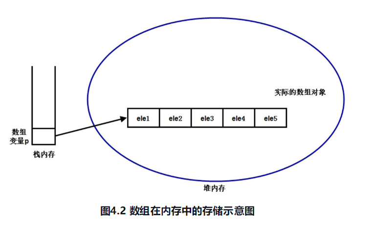
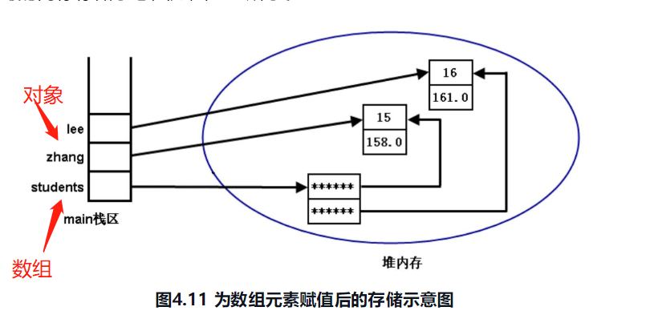
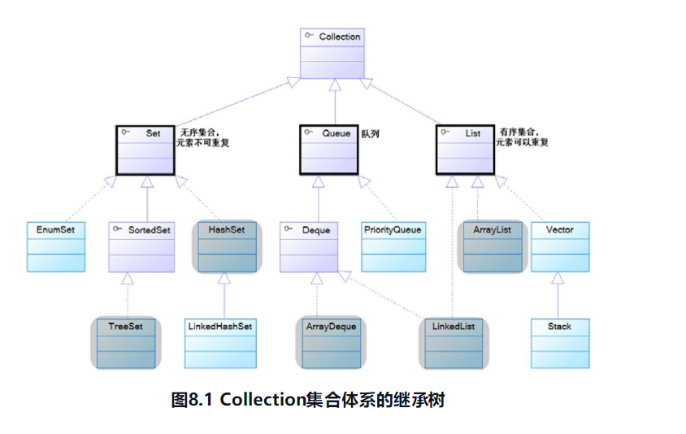
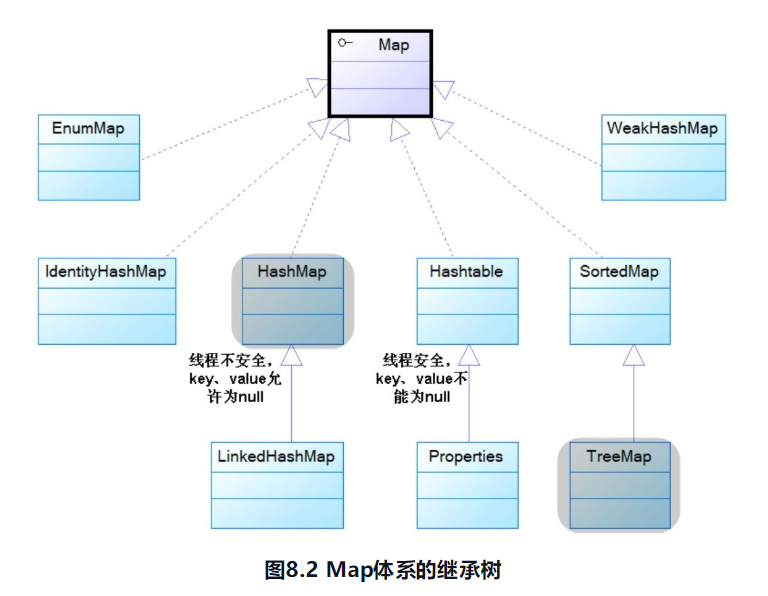
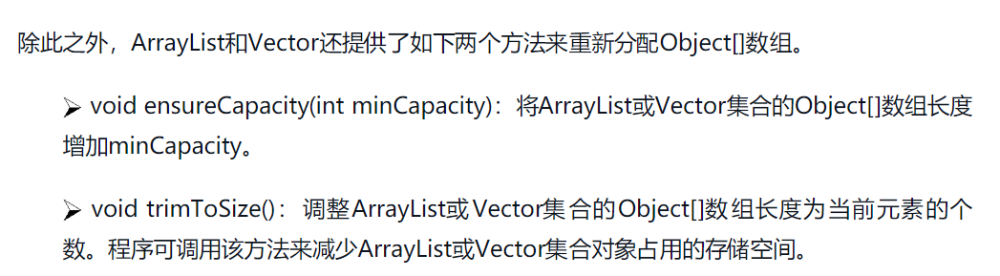
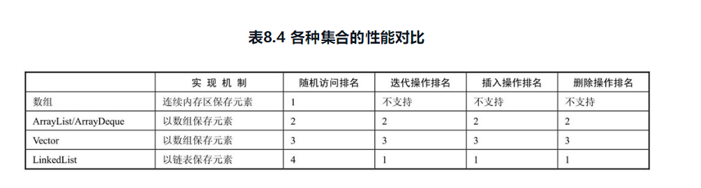
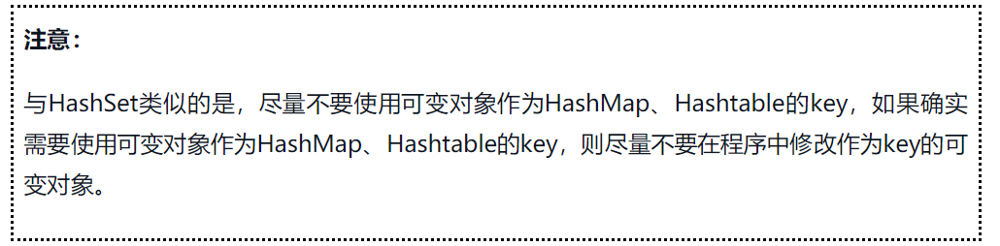

## week 12(date:2019111820191124)

### Algorithm

##### leetcode 中级算法-篇

1. **三数之和**：https://leetcode-cn.com/explore/interview/card/top-interview-questions-medium/29/array-and-strings/75/

   题目描述:
   
   给定一个包含 *n* 个整数的数组 `nums`，判断 `nums` 中是否存在三个元素 *a，b，c ，*使得 *a + b + c =* 0 ？找出所有满足条件且不重复的三元组。
   
   **示例:**

```
例如, 给定数组 nums = [-1, 0, 1, 2, -1, -4]，

满足要求的三元组集合为：
[
  [-1, 0, 1],
  [-1, -1, 2]
]
```

思路:

首先对数组进行排序，排序后固定一个数nums[i],在使用左右指针nums[i]后面的两端，数字分别为nums[L]和nums[R],计算三个数的和sum判断是否满足为0，满足则添加进结果集。

如果nums[i]大于0，则三数之和必然无法等于0，结束循环。

如果nums[i]==nums[i-1],则说明该数字重复。

当sum==0时，nums[L]==nums[L+1]  结果重复。

当sum==0时，nums[R]==nums[R+1] 则会导致结果重复。

当时间复杂度：O(n^2),n 为 数组长度。

```java
	public static List<List<Integer>> threeSum(int[] nums) {
            List<List<Integer>> ans = new ArrayList();
            int len = nums.length;
            if(nums == null || len < 3) return ans;
            Arrays.sort(nums); // 排序
            for (int i = 0; i < len ; i++) {
                if(nums[i] > 0) break; // 如果当前数字大于0，则三数之和一定大于0，所以结束循环
                if(i > 0 && nums[i] == nums[i-1]) continue; // 去重
                int L = i+1;
                int R = len-1;
                while(L < R){
                    int sum = nums[i] + nums[L] + nums[R];
                    if(sum == 0){
                        ans.add(Arrays.asList(nums[i],nums[L],nums[R]));
                        while (L<R && nums[L] == nums[L+1]) L++; // 去重
                        while (L<R && nums[R] == nums[R-1]) R--; // 去重
                        L++;
                        R--;
                    }
                    else if (sum < 0) L++;
                    else if (sum > 0) R--;
                }
            }        
            return ans;
    }
```

### Review

## Machine Learning Algorithms Explained - Support Vector Machines

##### ：https://blog.easysol.net/machine-learning-algorithms-6/

##### 单词:

1. As a reminder 提醒下
2.  comprised  包含
3.  separate into    分离
4. categories  类别
5. vehicle  交通工具
6. individuals 个体
7. mathematical formula 数学公式
8. dashed 虚线
9. orthogonal  正交直线
10. boundary 边界
11. valuable 有价值的
12. scatter  分散
13. consists 组成
14. original  原始
15. concept  概念
16. polynomial 多项式
17. kernel 核

##### 文章大意：

​    介绍了svm（支持向量机算法的原理），svm是使用数学公式将数据集分开，找到一个分类边界，使得每个数据点到该边界的和最小。支持向量机算法适用于多种分类问题，无论是线性分类还是非线性分类，可以通过过挑选合适的核函数（线性核函数，多项式核函数，高斯核函数）进行分类。

###### **优缺点**

- 优势

  - 对于线性模型有出色的性能
  - 对于大型数据有良好的扩展
  

缺点

- 不容易挑选最好的核函数
  - 在变量多的数据集的效果不好


### Tips

- java 语言

  - 可变参数  public void（int id,String... input）{} 使用 `...`
  

### Share

##### 《疯狂Java讲义（第2版）》 读书笔记一

##### **一、数组**

数组是一种引用类型。

实际的数组对象存储在堆（head）内存中，当数组引用对象是局部对象时，被存储在栈（stack）内存中。

当数组里面存储的是对象时，堆内存中存储的是对象的引用。如下图：



当堆内存中的对象，没有被引用对象所引用时，系统的垃圾回收器才会在适当的时候回收它。

Java提供Arrays类对数组进行操作。常用方法如下：

sort(T[]) :对数组的元素进行自然排序，要求元素必须实现了Comparable
sort(T[],Comparator):对数组的元素进行定制排序，元素本身可以不实现Comparable
binarySearch(T[],key):对数组通过二分搜索法进行查找，如果key找到了，返回索引，否则返回负数。

copyOf(T[],length):复制数组的元素

equals(T[],T[]):判断两个数组的内容是否相等

fill(T[],key):填充数组的各元素值为key

toString():将数组各元素进行拼接，返回String

**二、java集合**

java的集合类主要负责保存、盛装其他数据。

java集合类主要有两个接口：Collection、Map





- Set 集合

  特征：没有顺序，不包含相同对象。

  - HashSet  
    - 不是线程同步的
    - 调用HashCode决定存储位置。
    - 根据equals() 和hashCode的值判断是否相等
    
  - TreeSet
    
    - 可以保证元素集合处于排序状态
    - 把对象插入TreeSet必须实现Comparable接口
    - 推荐在TreeSet和HashSet中放入不可变对象。
    - TreeSet 使用了红黑树，也就是一棵自平衡的排序二叉树，这样就可以保证快速检索指定节点
    
    TreeSet、HashSet、EnumSet都不是线程安全的。可以通过使用如下方法：
    
    Set<Object> set = **Collections.synchronizedSet**(new HashSet<>());
  
- List集合

  - ArrayList

    - ArrayList和Vector初始长度initilCapacity 的默认值为10

      

      - 线程不安全。实际使用也不推荐使用Vector（线程安全），使用Collections将ArrayList转为线程安全。

  - Vector

    - 线程安全

- Queue集合

  - Queue 队列：“先进先出”（FIFO）的容器
  - Deque 双端队列：不仅可以当成双端队列，还可以当做栈使用。

  各种线性表的性能分析：

- Map

  Map用于保存具有映射关系的数据。key不允许重复，通过指定的key可以找到唯一、确定的value。

  - HashMap

    - 线程不安全、性能比Hashtable 好

  - Hashtable

    - 线程安全

    

  - TreeMap
    - TreeMap就是一个红黑树数据结构，每个key-value作为红黑树节点。TreeMap可以保证所有节点处于有序状态。TreeMap有两种排序方式：
      1. 自然排序：TreeMap的所有key必须实现Comparable接口。key要是同一类的对象。
      2. 定制排序：创建TreeMap时，传入Comparator对象，该对象负责对所有的key进行排序。