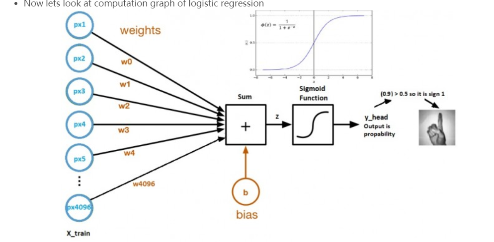
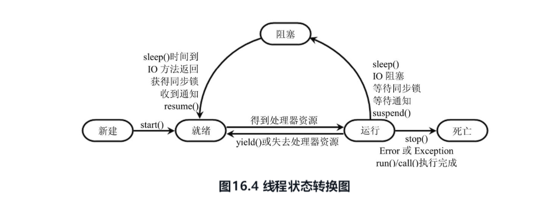

## week 13(date:2019112520191201)

### Algorithm

##### leetcode 中级算法-篇

1. **无重复字符的最长子串**：https://leetcode-cn.com/explore/interview/card/top-interview-questions-medium/29/array-and-strings/78/

   题目描述:
   
   给定一个字符串，请你找出其中不含有重复字符的 **最长子串** 的长度。
   

思路:使用滑动窗口[i,j]，使用set判断是否存在重复，重复则让i++，不重复则让j++；

```java
     public int lengthOfLongestSubstring(String s) {
        int n = s.length();
        Set<Character> set = new HashSet<>();
        int ans = 0, i = 0, j = 0;
        while (i < n && j < n) {
            if (!set.contains(s.charAt(j))){
                set.add(s.charAt(j));
                j++;
                ans = Math.max(ans, j - i);
            }
            else {
                set.remove(s.charAt(i));
                i++;
            }
        }
        return ans;
    }

```

### Review

## Deep Learning Tutorial for Beginners 

##### ：https://www.kaggle.com/kanncaa1/deep-learning-tutorial-for-beginners

##### 单词:

1. paragraphs 段落
2.  emphasize  着重
3. computation 估算
4. forward propagation 正向传播
5. Optimization Algorithm with Gradient Descent 梯度下降优化算法
6. Questions in Minds  思考问题
7. artificial  人造的
8. neural  神经
9. bias 偏差
10. convolutional 卷积
11. accuracy 准确性
12. insufficient  不足的
13.  in terms of  依据
14. manually 手动
15. dimensional  空间
16. transpose 转置
17. infinity 无穷

​    介绍了深度学习，并通过相应的例子解释。

深度学习是机器学习的的一种。手工需要给定特征。

Logistic Regression 是深度学习最简单的一种。实现Logistic Regression 的步骤如下：

1. 构建训练集（80%）、测试集（20%），构建测试图片（64*64）的矩阵。

2. 

   1.  Logistic Regression

      1. 参数是weight和bias
      2. weight是每个像素点的系数
      3. **z = (w.t)x + b**  w.t 为w向量的转置 或者 **z = b + px1*w1 + px2*w2 + ... + px4096*w4096**
      4. **y_head = sigmoid(z)**
      5. sigmoid是个函数 如上图

   2. 前向传播步骤：

      ```python
      # Forward propagation steps:
      # find z = w.T*x+b
      # y_head = sigmoid(z)
      # loss(error) = loss(y,y_head) 损失函数
      # cost = sum(loss) 代价函数
      def forward_propagation(w,b,x_train,y_train):
          z = np.dot(w.T,x_train) + b
          y_head = sigmoid(z) # probabilistic 0-1
          loss = -y_train*np.log(y_head)-(1-y_train)*np.log(1-y_head)
          cost = (np.sum(loss))/x_train.shape[1]      # x_train.shape[1]  is for scaling
          return cost 
      ```

   3. 然后使用反向传播更新参数：

      ```python
      # In backward propagation we will use y_head that found in forward progation
      # Therefore instead of writing backward propagation method, lets combine forward propagation and backward propagation
      def forward_backward_propagation(w,b,x_train,y_train):
          # forward propagation
          z = np.dot(w.T,x_train) + b
          y_head = sigmoid(z)
          loss = -y_train*np.log(y_head)-(1-y_train)*np.log(1-y_head)
          cost = (np.sum(loss))/x_train.shape[1]      # x_train.shape[1]  is for scaling
          # backward propagation
          derivative_weight = (np.dot(x_train,((y_head-y_train).T)))/x_train.shape[1] # x_train.shape[1]  is for scaling
          derivative_bias = np.sum(y_head-y_train)/x_train.shape[1]                 # x_train.shape[1]  is for scaling
          gradients = {"derivative_weight": derivative_weight,"derivative_bias": derivative_bias}
          return cost,gradients
      ```

### Tips

- 

### Share

##### 《疯狂Java讲义（第2版）》 读书笔记二

#### **一、多线程**

- ###### 线程概述

  - 进程和线程
  - 进程的特性（独立性、动态性、并发性）
  - 线程也被称作轻量级进程。线程是进程的执行单元，线程不拥有系统资源。与该进程所拥有的的全部资源。
  - 线程是独立运行的、抢占式的。

- ###### 线程的创建与启动

  - Java多线程实现的多种方式

  1. 继承Thread类创建线程

     1. 重写run**方法
     2. 使用start()启动线程。

  2. 实现Runnable接口创建线程（可以共享同一线程类的实例属性）

     1. 定义Runable接口实现类、重写run方法。
     2. 创建Runable实现类实例，并且以此实例作为Thread的target来创建Thread对象。`new Thread(Runnable实现类的对象)`
     3. 调用线程对象的start()方法启动该线程。

  3. 使用Callable和Future创建线程

     特点

     1. 提供了call()方法可以作为线程执行体，比run()方法更强大。
        1. 可以有返回值
        2. 可以抛出异常

     创建线程步骤：

     	1. 创建Callable接口的实现类，并实现call()方法，该call()方法作为线程执行体，并且有返回值。
      	2. 创建Callable实现类的实例，使用FutureTask类包装Callable对象，该FutureTask对象封装了该Callable对象的call()方法的返回值。
      	3. 使用FutureTask对象作为Thread对象的target创建并且启动新线程。
      	4. 调用FutureTask对象的get()方法获得子线程执行结束后的返回值。

 - ###### 线程的生命周期

   ​	线程的生命周期主要包括新建、就绪、阻塞、运行、死亡。下面是**线程状态的转化图**：

   ​	

- ##### 控制线程

  - join()方法：让一个进程等待另一个进程的完成。
  - sleep()方法：让当前的线程暂停一段时间，并且进入阻塞状态。
  - yield()方法：让当前的线程暂停，不会阻塞线程，只是进入就绪状态，让线程调度器重新调度一次。
  - 线程优先级：线程的优先级1-10,数值越大优先级越高。可以使用setPriority()设置优先级。

- ##### 线程同步

  线程调度具有随机性，多线程访问同一个数据，容易出现线程安全问题。

  - **使用 synchronized 关键字**（可以修饰方法、代码块，不能修饰构造器、属性等）
    - 同步代码块
    - 同步方法
  - 使用同步锁Lock()方法（使用ReentrantLock对象实例在方法体中的开始lock.lock锁定，方法体执行结束lock.unlock()解锁）

- ##### 线程通信（需要使用同步监视器，需要使用synchronized修饰。可以是同步代码块或者同步方法。如果使用Lock对象，则需要使用Condition控制线程通信。）

  - wait() :使当前线程等待，直到其他线程调用该同步监视器的notify()或者notifyAll()方法唤醒该线程。
  - notify()：唤醒等待单个线程，如果有多个，随机选择其中一个。
  - notifyAll()：方法唤醒等待所有线程。

- ##### 线程池

  系统启动一个新线程的成本比较高，为了提高性能，使用线程池可以很好提高性能。对于多cpu，使用**ForkJoinPool**将一个任务分解成多个小任务并行计算，将多个小任务的结果合并成总的计算结果。

  使用线程池执行线程任务的步骤

  1. 调用Executors类的静态工厂方法创建ExecutorService对象，该对象代表线程池。

  2. 创建Runnable实现类或Callable的类实例作为线程执行体。

  3. 调用ExecutorService对象的submit() 方法提交Runnable实现类或Callable的类实例

  4. 使用ExecutorService对象的shutdown()方法关闭线程池。

     

  

