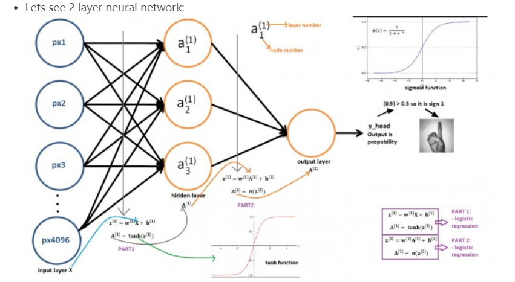

## week 14(date:20191209-20191215)

### Algorithm

##### leetcode 中级算法-篇

1. **两数相加**：https://leetcode-cn.com/explore/interview/card/top-interview-questions-medium/31/linked-list/82/

   题目描述:
   
   给出两个 **非空** 的链表用来表示两个非负的整数。其中，它们各自的位数是按照 **逆序** 的方式存储的，并且它们的每个节点只能存储 **一位** 数字。
   
   如果，我们将这两个数相加起来，则会返回一个新的链表来表示它们的和。
   
   您可以假设除了数字 0 之外，这两个数都不会以 0 开头。
   
   **示例:**
   
   ```
   输入：(2 -> 4 -> 3) + (5 -> 6 -> 4)
   输出：7 -> 0 -> 8
   原因：342 + 465 = 807
   ```
   
   思路:

```java
public ListNode addTwoNumbers(ListNode l1, ListNode l2) {
        ListNode res=new ListNode(0);
        ListNode abc=res;
        int over=0;
        while(l1!=null||l2!=null){
            if(l1==null){
                int val;
                if(l2.val+over>9){            
                    val=l2.val+over-10;
                    over=1;
                }else{
                    val=l2.val+over;
                    over=0;
                }
                res.next=new ListNode(val);
                l2=l2.next;
                res=res.next;        
                continue;
            }
            if(l2==null){
                int val;
                if(l1.val+over>9){            
                    val=l1.val+over-10;
                    over=1;
                }else{
                    val=l1.val+over;
                    over=0;
                }
                res.next=new ListNode(val);
                l1=l1.next;
                res=res.next;
                continue;
            }
 
            if(l1.val+l2.val+over>9){         
                res.next=new ListNode(l1.val+l2.val+over-10);
                l1=l1.next;
                l2=l2.next;
                res=res.next;
                over=1;

            }else{  
                res.next=new ListNode(l1.val+l2.val+over);
                l1=l1.next;
                l2=l2.next;
                res=res.next;
                over=0;
            }

        }
        if(over==1){
            res.next=new ListNode(1);
        }
        return abc.next;
    }

```

### Review

## Deep Learning Tutorial for Beginners 2

### Artificial Neural Network (ANN)

##### ：https://www.kaggle.com/kanncaa1/deep-learning-tutorial-for-beginners

##### 单词:

1. slope 斜坡
2. derivative  导数/派生物
3. term  学术
4. hyperparameter  超参数
5. mathematic 数学的
6. gradients 渐变
7. conclusion 结论
8. artificial  人造的
9. tuned 调整
10. scaling 缩放比例
11. basically 主要的
12. hidden  layer   隐藏层
13.  pretty 漂亮的
14. stick  坚持
15. 

​    介绍了ANN 人工神经网络。深度学习（deep learning）deep的含义是有多少隐藏层。

- 两层神经网络,中间的为隐藏层，头尾分别为输入层和输出层。

  

  对于图像的案例，有4096个输入层，对于a1来说每个输入层，使用线性函数进行求和后，经过一个激活函数，生成a1。a1与其他a2,a3 经过线性函数求和到输出层，输出层经过激活函数,判断分类类型。

### Tips

- 

### Share

##### 《疯狂Java讲义（第2版）》 读书笔记四

#### **一、反射**

​	反射的使用时机，程序在编译时无法预知该对象的具体信息，只能在运行时发现该对象的类的真实信息

- ##### 通过反射查看类信息

  - 获取Class对象 方式
    - Class.forName(String clazzNae)
    - 使用.class 例如：Person.Class
    - 调用对象的getClass()
  - 获取构造器（Constructor）其他类似：方法（Method）、字段（FIeld）
    - Class.getConstructor(Class<?>.. parameterTypes)  返回public 指定的构造器
    - Class.getDeclaredConstructor(Class<?>.. parameterTypes)  返回指定的构造器，与权限无关
    - Class.getConstructors()  返回所有public的构造器
    - Class.getDeclaredConstructors()  返回所有的构造器

- ##### 使用反射操作对象

  - 创建对象
    - 调用Class对象的newInstance()
    - 调用Constructor 对象的newInstance()
  - 调用方法
    - 使用Method对象的 invoke(Object obj,Object... args)
  - 属性值（field.setAccessible(trur) 取消访问权限）
    - 调用Field 对象的 getXxx(Object obj) 获取obj对象的该Field的属性值
    - 调用Field 对象的 setXxx(Object obj) 设置obj对象的该Field的属性值

- ##### 动态代理和AOP（https://blog.csdn.net/fuzhongmin05/article/details/61615149）

  ​	AOP的意思就是面向切面编程。**AOP注重的是解决许多问题的方法中的共同点，是对OO思想的一种补充！**还是拿人家经常举的一个例子讲解一下吧：比如说，我们现在要开发的一个应用里面有很多的业务方法，但是，我们现在要对这个方法的执行做全面监控,或部分监控。

  ```java
  
  public class Hello implements IHello {
      public void sayHello(String name) {
          System.out.println("Hello " + name);
      }
  }
  ```

  ```java
  public class HelloProxy implements IHello {
       private IHello hello;
       public HelloProxy(IHello hello) {
           this.hello = hello;
       }
       public void sayHello(String name) {
          Logger.logging(Level.DEBUGE, "sayHello method start.");
          hello.sayHello(name);
          Logger.logging(Level.INFO, "sayHello method end!");
       }
  ```

  ```java
  public class Test {
      public static void main(String[] args) {
          IHello hello = new HelloProxy(new Hello());
          hello.sayHello("Doublej");
      }
  }
  ```

  ```java
  
  public class Logger{
      /**
       * 根据等级记录日志
       * @param level
       * @param context
       */
      public static void logging(Level level, String context) {
          if (level.equals(Level.INFO)) {
              System.out.println(new Date().toLocaleString() + " " + context);
          }
          if (level.equals(Level.DEBUGE)) {
              System.err.println(new Date() + " " + context);
          }
      }
  
  ```

  最简单的aop 增强了Hello的功能。但是我们会发现一个问题，如果我们像Hello这样的类很多，那么，我们是不是要去写很多个HelloProxy这样的类呢？在jdk1.3以后，jdk跟我们提供了一个API,即**java.lang.reflect.InvocationHandler**的类。 这个类可以让我们在JVM调用某个类的方法时动态的为些方法做些什么事

  ```java
  import java.lang.reflect.InvocationHandler;
  import java.lang.reflect.Method;
  import java.lang.reflect.Proxy;
  public class DynaProxyHello implements InvocationHandler {
      /**
       * 要处理的对象(也就是我们要在方法的前后加上业务逻辑的对象,如例子中的Hello)
       */
      private Object delegate;
      /**
       * 动态生成方法被处理过后的对象 (写法固定)
       * 
       * @param delegate
       * @param proxy
       * @return
       */
      public Object bind(Object delegate) {
          this.delegate = delegate;
          return Proxy.newProxyInstance(
                  this.delegate.getClass().getClassLoader(), this.delegate
                          .getClass().getInterfaces(), this);
      }
      /**
       * 要处理的对象中的每个方法会被此方法送去JVM调用,也就是说,要处理的对象的方法只能通过此方法调用
       * 此方法是动态的,不是手动调用的
       */
      public Object invoke(Object proxy, Method method, Object[] args) throws Throwable {
          Object result = null;
          try {
              //执行原来的方法之前记录日志
              Logger.logging(Level.DEBUGE, method.getName() + " Method end .");
              
              //JVM通过这条语句执行原来的方法(反射机制)
              result = method.invoke(this.delegate, args);
              //执行原来的方法之后记录日志
              Logger.logging(Level.INFO, method.getName() + " Method Start!");
          } catch (Exception e) {
              e.printStackTrace();
          }
          //返回方法返回值给调用者
          return result;
      }
  }
  
  ```

  ```java
  public class Test {
      public static void main(String[] args) {
          IHello hello = (IHello)new DynaProxyHello().bind(new Hello());
          hello.sayGoogBye("Double J");
          hello.sayHello("Double J");
      }
  }
  
  ```

  将操作者解耦

  ```java
  public class LoggerOperation implements IOperation {
      public void end(Method method) {
          Logger.logging(Level.DEBUGE, method.getName() + " Method end .");
      }
      public void start(Method method) {
          Logger.logging(Level.INFO, method.getName() + " Method Start!");
      }
  }
  
  ```

  使用反射机制解耦操作者

  ```java
  
  import java.lang.reflect.InvocationHandler;
  import java.lang.reflect.Method;
  import java.lang.reflect.Proxy;
  public class DynaProxyHello implements InvocationHandler {
      /**
       * 操作者
       */
      private Object proxy;
      /**
       * 要处理的对象(也就是我们要在方法的前后加上业务逻辑的对象,如例子中的Hello)
       */
      private Object delegate;
   
   
      /**
       * 动态生成方法被处理过后的对象 (写法固定)
       * 
       * @param delegate
       * @param proxy
       * @return
       */
      public Object bind(Object delegate,Object proxy) {
         
          this.proxy = proxy;
          this.delegate = delegate;
          return Proxy.newProxyInstance(
                  this.delegate.getClass().getClassLoader(), this.delegate
                          .getClass().getInterfaces(), this);
      }
      /**
       * 要处理的对象中的每个方法会被此方法送去JVM调用,也就是说,要处理的对象的方法只能通过此方法调用
       * 此方法是动态的,不是手动调用的
      */
      public Object invoke(Object proxy, Method method, Object[] args) throws Throwable {
          Object result = null;
          try {
          //反射得到操作者的实例
              Class clazz = this.proxy.getClass();
              //反射得到操作者的Start方法
              Method start = clazz.getDeclaredMethod("start",new Class[] { Method.class });
              //反射执行start方法
              start.invoke(this.proxy, new Object[] { method });
              //执行要处理对象的原本方法
              result = method.invoke(this.delegate, args);
              //反射得到操作者的end方法
              Method end = clazz.getDeclaredMethod("end",new Class[] { Method.class });
              //反射执行end方法
              end.invoke(this.proxy, new Object[] { method });
          } catch (Exception e) {
              e.printStackTrace();
          }
          return result;
      }
  }
  ```

  ```java
  public class Test {
      public static void main(String[] args) {
          IHello hello = (IHello)new DynaProxyHello().bind(new Hello(),new LoggerOperation());
          hello.sayGoogBye("Double J");
          hello.sayHello("Double J");
          
      }
  }
  
  ```

  