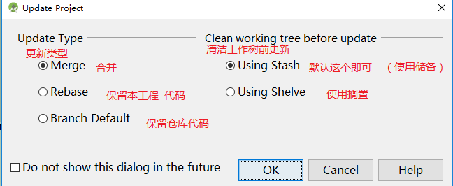
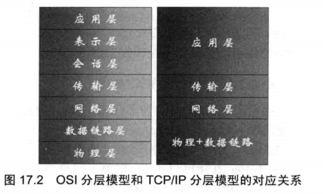
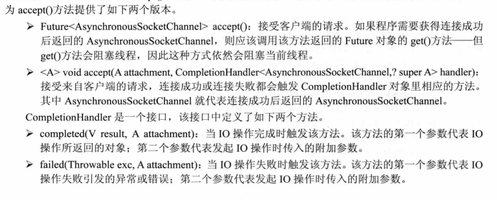

## week 15(date:20191216-20191229)

### Algorithm

##### leetcode 中级算法-篇

1. ** 奇偶链表**：https://leetcode-cn.com/explore/interview/card/top-interview-questions-medium/31/linked-list/83/

   题目描述:
   
   给定一个单链表，把所有的奇数节点和偶数节点分别排在一起。请注意，这里的奇数节点和偶数节点指的是节点编号的奇偶性，而不是节点的值的奇偶性。
   
   请尝试使用原地算法完成。你的算法的空间复杂度应为 O(1)，时间复杂度应为 O(nodes)，nodes 为节点总数。
   
   **示例:**
   
   ```
   输入: 1->2->3->4->5->NULL
   输出: 1->3->5->2->4->NULL
   ```
   
   思路:将奇节点放在一个链表里，偶链表放在另一个链表里。然后把偶链表接在奇链表的尾部。（https://leetcode-cn.com/problems/odd-even-linked-list/solution/qi-ou-lian-biao-by-leetcode/）

```java
public class Solution {
    public ListNode oddEvenList(ListNode head) {
        if (head == null) return null;
        ListNode odd = head, even = head.next, evenHead = even;
        while (even != null && even.next != null) {
            odd.next = even.next;
            odd = odd.next;
            even.next = odd.next;
            even = even.next;
        }
        odd.next = evenHead;
        return head;
    }
}

```

### Review

### Spring Boot 官方文档阅读

##### ：https://spring.io/projects/spring-boot#overview 

##### ：https://spring.io/guides/gs/rest-service/

##### 单词:

1. production-grade 生产级

2.  minimum fuss 最小化的繁琐

3. metrics 度量

4. health checks 健康检查

5. externalized configuration 外部配置

6. Bootstrap  引导

7. Guides  指南

8. Tutorials 教程

9. reference 参考文档

10. bypass  跳过

11. scratch ？

12. start from scratch  从头开始

13. representation 代表/表现

14. interactions 交互

15. concise  简明

16. absent  缺席

    介绍了如何使用spring boot快速构建一个restfull 风格的web，spring boot内嵌tomacat，可以直接运行web程序。`@RestController`注解是`@Controller` 和 `@ResponseBody` 组合。`@SpringBootApplication` 是`@Configuration`、`@EnableAutoConfiguration`、`@ComponentScan `的组合

### Tips

- idea快捷键  git使用
  - ctrl + K push
  - ctrl+T  pull
  - 
- mysql  
  - mysql 的**group_concat()**函数返回的字符长度有限制，可以通过`group_concat_max_len = 4294967295（也可以为-1最大值）`设置

### Share

##### 《疯狂Java讲义（第2版）》 读书笔记五

#### **一、网络编程**

- ##### 网络基础

  - OSI模型
  - TCP协议
  - IP协议

  ​	协议之间的对应关系:

  

- ##### Java网络支持

  - URLDecoder和URLEncoder 用于完成普通字符串和application/x-www-form-urlencoded Mime 字符串之间的相互转换。使用方式
    - URLDecoder.decode("","utf-8"） 将 application/x-www-form-urlencoded 转为 普通字符
    - URLEncoder .encode("","utf-8")  将 普通字符 转为 application/x-www-form-urlencoded
  
- ##### Socket通信多线程

  - 服务器端使用  ServerSocket类，为每一个连接启动一个线程。接收数据，并且将数据发送给每个客户端。

    ```java
    public class MyServer {
    	// 定义保存所有Socket的ArrayList，并将其包装为线程安全的
    	public static List<Socket> socketList = Collections.synchronizedList(new ArrayList<>());
    
    	public static void main(String[] args) throws IOException {
    		ServerSocket ss = new ServerSocket(30000);
    		while (true) {
  			// 此行代码会阻塞，将一直等待别人的连接
    			Socket s = ss.accept();
    			socketList.add(s);
    			// 每当客户端连接后启动一条ServerThread线程为该客户端服务
    			new Thread(new ServerThread(s)).start();
    		}
    	}
    }
    ```
  
    ```java
    // 负责处理每个线程通信的线程类
    public class ServerThread implements Runnable {
  	// 定义当前线程所处理的Socket
    	Socket s = null;
    	// 该线程所处理的Socket所对应的输入流
    	BufferedReader br = null;
    
    	public ServerThread(Socket s) throws IOException {
    		this.s = s;
    		// 初始化该Socket对应的输入流
    		br = new BufferedReader(new InputStreamReader(s.getInputStream()));
  	}
    
    	public void run() {
    		try {
    			String content = null;
    			// 采用循环不断从Socket中读取客户端发送过来的数据
    			while ((content = readFromClient()) != null) {
    				// 遍历socketList中的每个Socket，
    				// 将读到的内容向每个Socket发送一次
    				for (Socket s : MyServer.socketList) {
    					PrintStream ps = new PrintStream(s.getOutputStream());
    					ps.println(content);
    				}
    			}
    		} catch (IOException e) {
    			e.printStackTrace();
    		}
    	}
    
  	// 定义读取客户端数据的方法
    	private String readFromClient() {
  		try {
    			return br.readLine();
    		}
    		// 如果捕捉到异常，表明该Socket对应的客户端已经关闭
    		catch (IOException e) {
    			// 删除该Socket。
    			MyServer.socketList.remove(s); // ①
    		}
    		return null;
    	}
    }
    ```
  
    
  
  - 客户端使用 Socket 类，接收服务器端发送的数据。
  
    ```java
    public class MyClient
    {
    	public static void main(String[] args)throws Exception
    	{
    		Socket s = new Socket("127.0.0.1" , 30000);
    		// 客户端启动ClientThread线程不断读取来自服务器的数据
    		new Thread(new ClientThread(s)).start();   // ①
    		// 获取该Socket对应的输出流
    		PrintStream ps = new PrintStream(s.getOutputStream());
    		String line = null;
    		// 不断读取键盘输入
    		BufferedReader br = new BufferedReader(
    			new InputStreamReader(System.in));
    		while ((line = br.readLine()) != null)
    		{
    			// 将用户的键盘输入内容写入Socket对应的输出流
    			ps.println(line);
    		}
    	}
    }
    ```
  
    ```java
    public class ClientThread implements Runnable
    {
    	// 该线程负责处理的Socket
    	private Socket s;
    	// 该线程所处理的Socket所对应的输入流
  	BufferedReader br = null;
    	public ClientThread(Socket s)
    		throws IOException
    	{
    		this.s = s;
    		br = new BufferedReader(
    			new InputStreamReader(s.getInputStream()));
    	}
    	public void run()
    	{
    		try
  		{
    			String content = null;
  			// 不断读取Socket输入流中的内容，并将这些内容打印输出
    			while ((content = br.readLine()) != null)
    			{
    				System.out.println(content);
    			}
    		}
    		catch (Exception e)
    		{
    			e.printStackTrace();
    		}
    	}
    }
    ```
  ```
  
  ```
  
- AIO（异步IO）实现非阻塞通信

  - AsynchronousServerSocketChannel、AsynchronousSocketChannel是支持异步的Channel（通道）创建**AsynchronousServerSocketChannel** 步骤是open().bind()

  - 调用accept()

  - 实现CompletionHandler，重写其中的 `completed()`、`failed()` 方法。

    步骤如下

  ```java
  AsynchronousServerSocketChannel serverChannel=
  AsynchronousServerSocketChannel.open(channelGroup).bind(new InetSocketAddress(PORT));
  //2 accept
  serverChannel.accept(null, new AcceptHandler(serverChannel));  // 
  ```

  

  ```
  // 实现自己的CompletionHandler类 实现自己的监听器
  class AcceptHandler implements
  	CompletionHandler<AsynchronousSocketChannel, Object>
  {
  	private AsynchronousServerSocketChannel serverChannel;
  	public AcceptHandler(AsynchronousServerSocketChannel sc)
  	{
  		this.serverChannel = sc;
  	}
  
  	@Override
  	public void completed(final AsynchronousSocketChannel sc
  		, Object attachment)
  	{
  	}
  	@Override
  	public void failed(Throwable ex, Object attachment)
  	{
  
  	}
  }
  ```

  