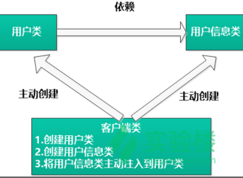
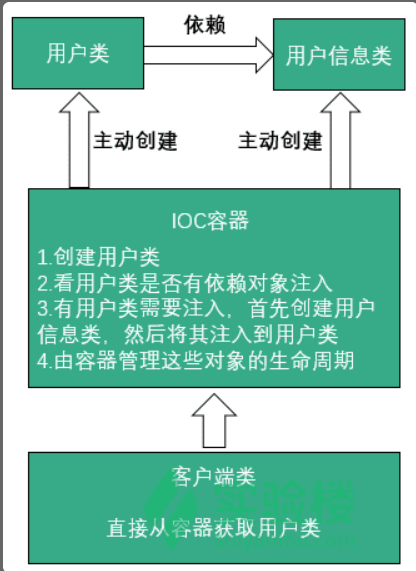
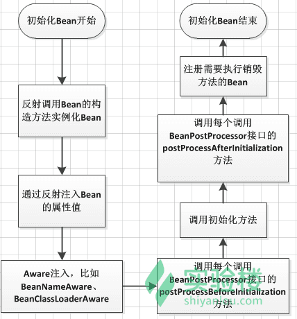

## week 16(date:20191230-20200105)

### Algorithm

##### leetcode 中级算法-篇

1. **中序遍历二叉树**：

   题目描述:
   
   给定一个二叉树，返回它的*中序* 遍历。
   
   **示例:**
   
   ```
   输入: [1,null,2,3]
      1
       \
        2
       /
      3
   
   输出: [1,3,2]
   ```
   
   思路:使用递归，先遍历左子树，再取当前节点的值，最后遍历右子树，递归退出条件为当前节点是否为空。

```java
class Solution {
    public List<Integer> inorderTraversal(TreeNode root) {
        List<Integer> res=new ArrayList<Integer>();
        inorderTraversalHelper(root,res);
        return res;
        
    }
    public void inorderTraversalHelper(TreeNode root,List<Integer> res){
        if(root!=null){
            inorderTraversalHelper(root.left,res);
            res.add(root.val);
            //System.out.println(root.val);       
            inorderTraversalHelper(root.right,res);
        }{
            return;
        }
        
    }
}
```

### Review

### Spring Boot Guides

##### Building Java Projects with Gradle：https://spring.io/guides/gs/gradle/

##### 单词:

1. elementary  基本的

2. occasionally 偶尔

3. effort 结果

4. dependencies 依赖性

5. indicates  表明

6. block  块

7.  indicates 约定

8. facilities established 设施的建立

9. notable  显著的

10. render  渲染

11.  bundled 捆绑

12.  quite handy 完全够用的

    文章介绍了如何使用gradle构建java应用，gradle使用maven的仓库和一些依赖，使用**Gradle Wrapper**构建是首选，因为该脚本支持跨平台，而且无需再系统上安装gradle，每个使用该项目的人都可以以相同的方式构建项目。下面是完整的`build.gradle`文件：

    ```gradle
    apply plugin: 'java'
    apply plugin: 'eclipse'
    apply plugin: 'application'
    
    mainClassName = 'hello.HelloWorld'
    
    // tag::repositories[]
    repositories {
        mavenCentral()
    }
    // end::repositories[]
    
    // tag::jar[]
    jar {
        baseName = 'gs-gradle'
        version =  '0.1.0'
    }
    // end::jar[]
    
    // tag::dependencies[]
    sourceCompatibility = 1.8
    targetCompatibility = 1.8
    
    dependencies {
        compile "joda-time:joda-time:2.2"
        testCompile "junit:junit:4.12"
    }
    // end::dependencies[]
    
    // tag::wrapper[]
    // end::wrapper[]
    ```

### Tips

- **Crontab模式** 日期序列生成器 。该模式是六个以空格分隔的字段的列表：代表秒，分钟，小时，天，月，周日。例子
  
  - "0 0 * * * *" = 每天的每小时
  - "*/10 * * * * *" = 每十秒
  - "0 0 8-10 * * *" =每天的8-10点
  - "0 0 6,19 * * *" = 每天的6点、19点
  - "0 0/30 8-10 * * *" = 每天的8:00、8:30、9:00、9:30、10:00、10:30
  - "0 0 9-17 * * MON-FRI" = 周一到周五的9点到17点
  
- mybatis 
  
  - 字符串的判断需要使用方法 
  
    ```bash
    <if test="sex=='Y'.toString()"></if>
    <if test = 'sex== "Y"'></if>
    不能使用：
    <if test="sex=='Y'"> </if>
    ```

### Share

#### spring框架学习笔记

#### 	一、什么是spring

​		Spring 是一个开源的轻量级 Java SE（ Java 标准版本）/Java EE（ Java 企业版本）开发应用框架，其目的是用于简化企业级应用程序开发。在传统应用程序开发中，一个完整的应用是由一组相互协作的对象组成的。所以开发一个应用除了要开发业务逻辑之外，最多的是关注使这些对象协作来完成所需功能的同时，实现低耦合、高内聚。Spring 框架可以帮我们来创建对象及管理这些对象之间的依赖关系，能通过配置方式来创建对象，**管理对象之间依赖关系**。

​		Spring 框架除了帮我们管理对象及其依赖关系，还提供像通用日志记录、性能统计、安全控制、异常处理等**面向切面**的能力，可以帮我们管理最头疼的**数据库事务**，同时，它本身提供了一套简单的 JDBC 访问实现，能与第三方数据库访问框架集成（如 Hibernate、JPA ），与各种 Java EE 技术整合（如 Java Mail、任务调度等等），提供一套自己的 web 层框架 Spring MVC 、而且还能非常简单的与第三方 web 框架集成。从这里我们可以认为 Spring 是一个超级粘合平台，除了自己提供功能外，还提供粘合其他技术和框架的能力，从而使我们可以更自由的选择到底使用什么技术进行开发。

##### 二、spring的作用

	1. Spring 能帮我们根据配置文件创建及组装对象之间的依赖关系。
 	2. Spring 面向切面编程能帮助我们无耦合的实现日志记录、性能统计、安全控制。
 	3. Spring 能非常简单的帮我们管理数据库事务。

##### 三、spring的Ioc

​    Ioc—Inversion of Control，即“控制反转”，它不是什么技术，而是一种设计思想。在 Java 开发中， Ioc 意味着将你设计好的对象交给容器控制，而不是传统的在你的对象内部直接控制。**传统 Java SE 程序设计，我们直接在对象内部通过 new 进行创建对象，是程序主动去创建依赖对象；而 IoC 是有专门一个容器来创建这些对象，即由 IoC 容器来控制对象的创建；主要控制了外部资源获取（不只是对象包括比如文件等）。**

​	DI—Dependency Injection，即“依赖注入”：是组件之间依赖关系由容器在运行期决定，形象的说，**即由容器动态的将某个依赖关系注入到组件之中。**

传统模式:



有了IOC/DI容器之后:



Spring IoC 容器如何知道哪些是它管理的对象呢？

这就需要配置文件，Spring IoC 容器通过读取配置文件中的配置元数据，通过元数据对应用中的各个对象进行实例化及装配。一般使用基于 xml 配置文件进行配置元数据，而且 Spring 与配置文件完全解耦的，可以使用其他任何可能的方式进行配置元数据，比如注解、基于 java 文件的、基于属性文件的配置都可以。

在 Spring Ioc 容器的代表就是 org.springframework.beans 包中的 **BeanFactory** 接口， BeanFactory 接口提供了 IoC 容器最基本功能；而 org.springframework.context 包下的 **ApplicationContext** 接口扩展了 BeanFactory ，还提供了与Spring AOP 集成、国际化处理、事件传播及提供不同层次的 context 实现 (如针对 web 应用的 WebApplicationContext )。简单说， BeanFactory 提供了 IoC 容器最基本功能，而 ApplicationContext 则增加了更多支持企业级功能支持。 

##### 四、spring中bean的定义

1. ##### 基于xml

   ```xml
   <bean id="FileNameGenerator" class="com.shiyanlou.spring.bean.FileNameGenerator">
           <property name="name">
               <value>shiyanlou</value>
           </property>
           <property name="type">
               <value>txt</value>
           </property>
       </bean><?xml version="1.0" encoding="UTF-8"?>
   <beans xmlns="http://www.springframework.org/schema/beans"
          xmlns:xsi="http://www.w3.org/2001/XMLSchema-instance"
          xsi:schemaLocation="http://www.springframework.org/schema/beans http://www.springframework.org/schema/beans/spring-beans.xsd">
       <!--一般方法-->
       <bean id="FileNameGenerator" class="com.shiyanlou.spring.bean.FileNameGenerator">
           <property name="name">
               <value>shiyanlou</value>
           </property>
           <property name="type">
               <value>txt</value>
           </property>
       </bean>
       <!-- 另一重配置方法 缩写方法-->
       <!-- 
           <bean id="FileNameGenerator" class="com.shiyanlou.spring.bean.FileNameGenerator">
                  <property name="name" value="shiyanlou" />
                  <property name="type" value="txt" />
              </bean>
        -->
   </beans>
   ```

   

2. ##### 基于注解

   注解是为 Spring 容器提供 Bean 定义的信息，把 XML 定义的信息通过类注解描述出来。众所周知，Spring容器三大要素：Bean 定义、 Bean 实现类以及 Spring 框架。如果采用 XML 配置，Bean 定义和 Bean 实现类本身分离，而采用注解配置，Bean 定义在 Bean 实现类上注解就可以实现。

   - **@Component** 
   - **@Autowired** 可以用来装配 bean，都可以写在字段上，或者方法上。
   - 除此之外，Spring 有三个与 @Component 等效的注解：
     1. @Controller:对应表现层的 Bean，也就是 Action 。
     2. @Service:对应的是业务层 Bean 。
     3. @Repository:对应数据访问层 Bean 。

3. ##### 基于Java类

##### 五、bean 的作用域与生命周期：

在 Spring 中，Bean 的作用域决定了从 Spring 容器中返回的 Bean 实例的类型。在 Spring 中，支持以下 5 种类型的作用域：

1. **singleton — 单例模式，由 IOC 容器返回一个唯一的 bean 实例。**
2. **prototype — 原型模式，被请求时，每次返回一个新的 bean 实例。**
3. request — 每个 HTTP Request 请求返回一个唯一的 Bean 实例。
4. session — 每个 HTTP Session 返回一个唯一的 Bean 实例。
5. globalSession — Http Session 全局 Bean 实例。

Spring框架中，一旦把一个Bean纳入Spring IOC容器之中，这个Bean的生命周期就会交由容器进行管理，一般担当管理角色的是BeanFactory或者ApplicationContext,认识一下Bean的生命周期活动，对更好的利用它有很大的帮助：

下面以BeanFactory为例，说明一个Bean的生命周期活动

- Bean的建立， 由BeanFactory读取Bean定义文件，并生成各个实例
- Setter注入，执行Bean的属性依赖注入
- BeanNameAware的setBeanName(), 如果实现该接口，则执行其setBeanName方法
- BeanFactoryAware的setBeanFactory()，如果实现该接口，则执行其setBeanFactory方法
- BeanPostProcessor的processBeforeInitialization()，如果有关联的processor，则在Bean初始化之前都会执行这个实例的processBeforeInitialization()方法
- InitializingBean的afterPropertiesSet()，如果实现了该接口，则执行其afterPropertiesSet()方法
- Bean定义文件中定义init-method
- BeanPostProcessors的processAfterInitialization()，如果有关联的processor，则在Bean初始化之前都会执行这个实例的processAfterInitialization()方法
- DisposableBean的destroy()，在容器关闭时，如果Bean类实现了该接口，则执行它的destroy()方法 -Bean定义文件中定义destroy-method，在容器关闭时，可以在Bean定义文件中使用“destory-method”定义的方法

如果使用**ApplicationContext**来维护一个Bean的生命周期，则基本上与上边的流程相同，只不过在执行BeanNameAware的setBeanName()后，若有Bean类实现了org.springframework.context.ApplicationContextAware接口，则执行其**setApplicationContext**()方法，然后再进行BeanPostProcessors的**processBeforeInitialization**() 实际上，ApplicationContext除了向BeanFactory那样维护容器外，还提供了更加丰富的框架功能，如Bean的消息，事件处理机制等。

